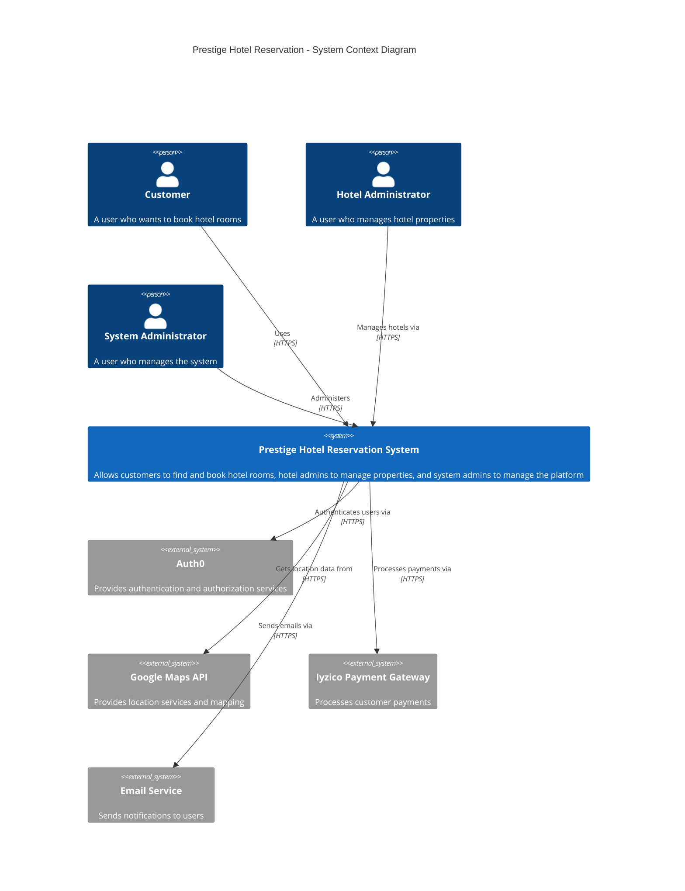
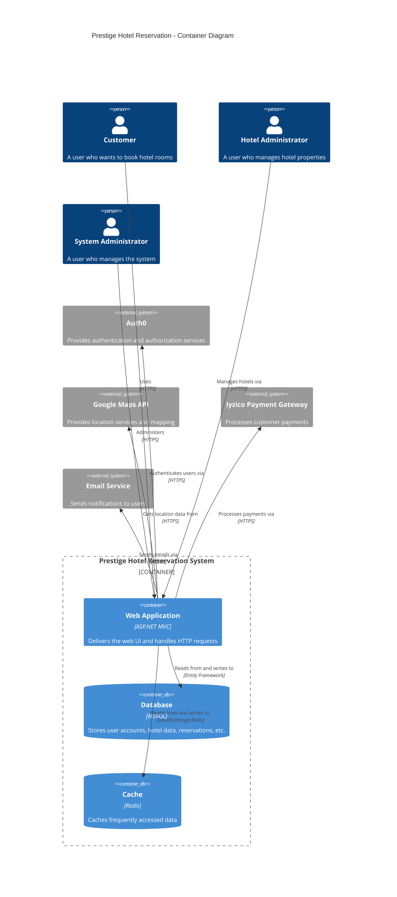
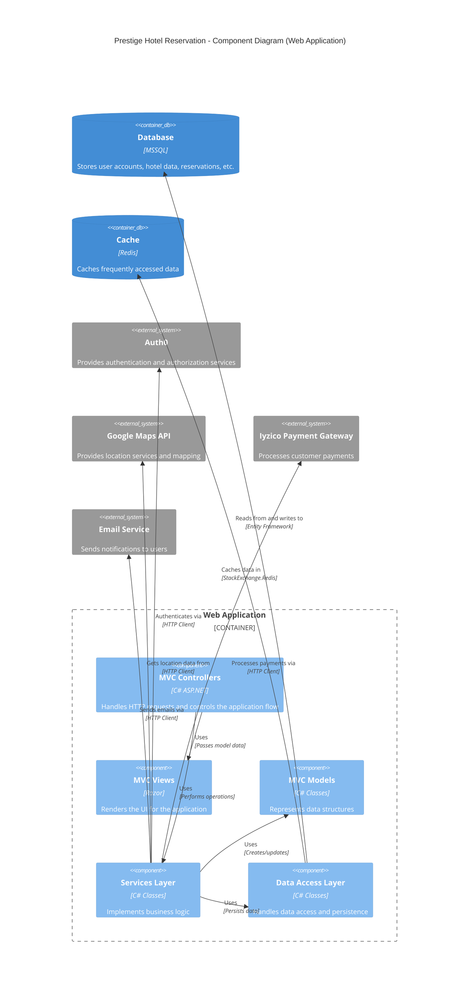

```mermaid
C4Context
    title Prestige Hotel Reservation - System Context Diagram

    Person(customer, "Customer", "A user who wants to book hotel rooms")
    Person(hotelAdmin, "Hotel Administrator", "A user who manages hotel properties")
    Person(sysAdmin, "System Administrator", "A user who manages the system")

    System(prestigeSystem, "Prestige Hotel Reservation System", "Allows customers to find and book hotel rooms, hotel admins to manage properties, and system admins to manage the platform")

    System_Ext(auth0, "Auth0", "Provides authentication and authorization services")
    System_Ext(googleMaps, "Google Maps API", "Provides location services and mapping")
    System_Ext(iyzico, "Iyzico Payment Gateway", "Processes customer payments")
    System_Ext(emailService, "Email Service", "Sends notifications to users")

    Rel(customer, prestigeSystem, "Uses", "HTTPS")
    Rel(hotelAdmin, prestigeSystem, "Manages hotels via", "HTTPS")
    Rel(sysAdmin, prestigeSystem, "Administers", "HTTPS")

    Rel(prestigeSystem, auth0, "Authenticates users via", "HTTPS")
    Rel(prestigeSystem, googleMaps, "Gets location data from", "HTTPS")
    Rel(prestigeSystem, iyzico, "Processes payments via", "HTTPS")
    Rel(prestigeSystem, emailService, "Sends emails via", "HTTPS")

    UpdateRelStyle(customer, prestigeSystem, $offsetY="10")
    UpdateRelStyle(hotelAdmin, prestigeSystem, $offsetX="-40")
    UpdateRelStyle(sysAdmin, prestigeSystem, $offsetX="40")
```

```mermaid
C4Container
    title Prestige Hotel Reservation - Container Diagram

    Person(customer, "Customer", "A user who wants to book hotel rooms")
    Person(hotelAdmin, "Hotel Administrator", "A user who manages hotel properties")
    Person(sysAdmin, "System Administrator", "A user who manages the system")

    Container_Boundary(prestigeSystem, "Prestige Hotel Reservation System") {
        Container(webApp, "Web Application", "ASP.NET MVC", "Delivers the web UI and handles HTTP requests")
        ContainerDb(mssql, "Database", "MSSQL", "Stores user accounts, hotel data, reservations, etc.")
        ContainerDb(redis, "Cache", "Redis", "Caches frequently accessed data")
    }

    System_Ext(auth0, "Auth0", "Provides authentication and authorization services")
    System_Ext(googleMaps, "Google Maps API", "Provides location services and mapping")
    System_Ext(iyzico, "Iyzico Payment Gateway", "Processes customer payments")
    System_Ext(emailService, "Email Service", "Sends notifications to users")

    Rel(customer, webApp, "Uses", "HTTPS")
    Rel(hotelAdmin, webApp, "Manages hotels via", "HTTPS")
    Rel(sysAdmin, webApp, "Administers", "HTTPS")

    Rel(webApp, mssql, "Reads from and writes to", "Entity Framework")
    Rel(webApp, redis, "Reads from and writes to", "StackExchange.Redis")

    Rel(webApp, auth0, "Authenticates users via", "HTTPS")
    Rel(webApp, googleMaps, "Gets location data from", "HTTPS")
    Rel(webApp, iyzico, "Processes payments via", "HTTPS")
    Rel(webApp, emailService, "Sends emails via", "HTTPS")
```

```mermaid
C4Component
    title Prestige Hotel Reservation - Component Diagram (Web Application)

    Container_Boundary(webApp, "Web Application") {
        Component(controllers, "MVC Controllers", "C# ASP.NET", "Handles HTTP requests and controls the application flow")
        Component(views, "MVC Views", "Razor", "Renders the UI for the application")
        Component(models, "MVC Models", "C# Classes", "Represents data structures")
        Component(services, "Services Layer", "C# Classes", "Implements business logic")
        Component(repositories, "Data Access Layer", "C# Classes", "Handles data access and persistence")
    }

    ContainerDb(mssql, "Database", "MSSQL", "Stores user accounts, hotel data, reservations, etc.")
    ContainerDb(redis, "Cache", "Redis", "Caches frequently accessed data")

    System_Ext(auth0, "Auth0", "Provides authentication and authorization services")
    System_Ext(googleMaps, "Google Maps API", "Provides location services and mapping")
    System_Ext(iyzico, "Iyzico Payment Gateway", "Processes customer payments")
    System_Ext(emailService, "Email Service", "Sends notifications to users")

    Rel(controllers, views, "Uses", "Passes model data")
    Rel(controllers, services, "Uses", "Performs operations")
    Rel(services, models, "Uses", "Creates/updates")
    Rel(services, repositories, "Uses", "Persists data")
    Rel(repositories, mssql, "Reads from and writes to", "Entity Framework")
    Rel(repositories, redis, "Caches data in", "StackExchange.Redis")
    
    Rel(services, auth0, "Authenticates via", "HTTP Client")
    Rel(services, googleMaps, "Gets location data from", "HTTP Client")
    Rel(services, iyzico, "Processes payments via", "HTTP Client")
    Rel(services, emailService, "Sends emails via", "HTTP Client")
``` 