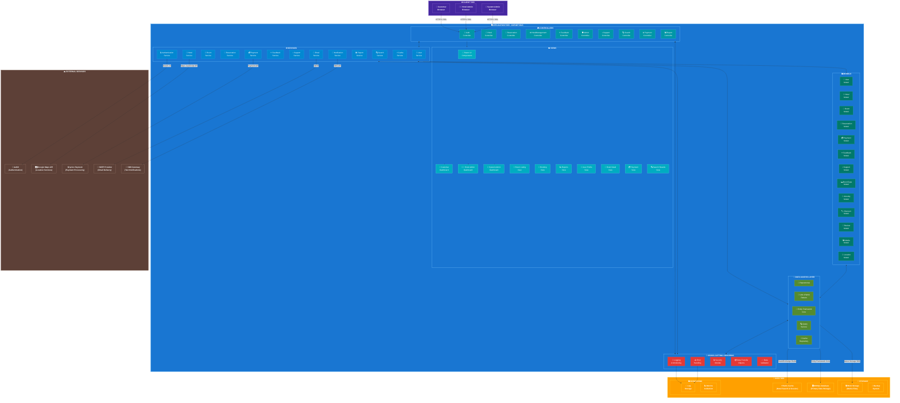

```mermaid
flowchart TD
    classDef clientNode fill:#4527A0,stroke:#7E57C2,stroke-width:2px,color:white,font-weight:bold
    classDef webNode fill:#1976D2,stroke:#64B5F6,stroke-width:2px,color:white,font-weight:bold
    classDef controllerNode fill:#0097A7,stroke:#4DD0E1,stroke-width:1px,color:white
    classDef modelNode fill:#00796B,stroke:#4DB6AC,stroke-width:1px,color:white
    classDef viewNode fill:#00ACC1,stroke:#80DEEA,stroke-width:1px,color:white
    classDef serviceNode fill:#0288D1,stroke:#29B6F6,stroke-width:1px,color:white
    classDef infrastructureNode fill:#FFA000,stroke:#FFCA28,stroke-width:2px,color:white,font-weight:bold
    classDef externalNode fill:#5D4037,stroke:#8D6E63,stroke-width:2px,color:white,font-weight:bold
    classDef dataAccessNode fill:#558B2F,stroke:#8BC34A,stroke-width:1px,color:white
    classDef securityNode fill:#E53935,stroke:#EF5350,stroke-width:1px,color:white

    %% Main Client Section
    subgraph Clients["🌐 CLIENT TIER"]
        CB["👤 Customer<br/>Browser"]
        HAB["👨‍💼 Hotel Admin<br/>Browser"]
        SAB["🔧 System Admin<br/>Browser"]
    end

    %% Main Web Application Section
    subgraph WebApp["🖥️ APPLICATION TIER - ASP.NET MVC"]
        %% Controllers Subsection
        subgraph Controllers["🎮 CONTROLLERS"]
            AuthC["🔐 Auth<br/>Controller"]
            HotelC["🏨 Hotel<br/>Controller"]
            ResC["📅 Reservation<br/>Controller"]
            HMC["⚙️ HotelManagement<br/>Controller"]
            FeedbackC["⭐ Feedback<br/>Controller"]
            AdminC["🛡️ Admin<br/>Controller"]
            SupportC["📞 Support<br/>Controller"]
            SearchC["🔍 Search<br/>Controller"]
            PaymentC["💲 Payment<br/>Controller"]
            ReportC["📊 Report<br/>Controller"]
        end

        %% Models Subsection
        subgraph Models["📊 MODELS"]
            UserM["👤 User<br/>Model"]
            HotelM["🏨 Hotel<br/>Model"]
            RoomM["🚪 Room<br/>Model"]
            ResM["📅 Reservation<br/>Model"]
            PaymentM["💳 Payment<br/>Model"]
            FeedbackM["⭐ Feedback<br/>Model"]
            SupportM["📞 Support<br/>Model"]
            RoomTypeM["🛏️ RoomType<br/>Model"]
            AmenityM["🧳 Amenity<br/>Model"]
            DiscountM["🏷️ Discount<br/>Model"]
            ReviewM["📝 Review<br/>Model"]
            MediaM["🖼️ Media<br/>Model"]
            LocationM["📍 Location<br/>Model"]
        end

        %% Views Subsection
        subgraph Views["👁️ VIEWS"]
            RazorUI["🧩 Razor UI<br/>Components"]
            CustDash["👤 Customer<br/>Dashboard"]
            HotelAdminDash["👨‍💼 Hotel Admin<br/>Dashboard"]
            SysAdminDash["🔧 System Admin<br/>Dashboard"]
            RoomListView["🏨 Room Listing<br/>View"]
            BookingView["📝 Booking<br/>View"]
            ReportView["📈 Reports<br/>View"]
            ProfileView["👤 User Profile<br/>View"]
            HotelDetailView["🏨 Hotel Detail<br/>View"]
            PaymentView["💳 Payment<br/>View"]
            SearchView["🔍 Search Results<br/>View"]
        end

        %% Services Subsection
        subgraph Services["⚙️ SERVICES"]
            UserS["👤 User<br/>Service"]
            HotelS["🏨 Hotel<br/>Service"]
            RoomS["🚪 Room<br/>Service"]
            ResS["📅 Reservation<br/>Service"]
            PaymentS["💳 Payment<br/>Service"]
            FeedbackS["⭐ Feedback<br/>Service"]
            SupportS["📞 Support<br/>Service"]
            EmailS["📧 Email<br/>Service"]
            NotificationS["🔔 Notification<br/>Service"]
            ReportS["📊 Report<br/>Service"]
            SearchS["🔍 Search<br/>Service"]
            CacheS["⚡ Cache<br/>Service"]
            AuthS["🔒 Authentication<br/>Service"]
        end
        
        %% Cross-cutting concerns
        subgraph CrossCut["🔄 CROSS-CUTTING CONCERNS"]
            Logging["📝 Logging<br/>& Monitoring"]
            ErrorH["⚠️ Error<br/>Handling"]
            Security["🔒 Security<br/>Module"]
            DTO["📦 Data Transfer<br/>Objects"]
            Validation["✅ Data<br/>Validation"]
        end

        %% Data Access Layer
        subgraph DataAccess["💾 DATA ACCESS LAYER"]
            Repos["📁 Repositories"]
            UnitOfWork["🔄 Unit of Work<br/>Pattern"]
            EFCore["🔌 Entity Framework<br/>Core"]
            QueryService["🔍 Query<br/>Service"]
            CacheRepo["⚡ Cache<br/>Repository"]
        end
    end

    %% Data Tier Section
    subgraph Infra["💾 DATA TIER"]
        Redis["⚡ Redis Cache<br/>(Hotel Search & Session)"]
        MSSQL["🗄️ MSSQL Database<br/>(Primary Data Storage)"]
        subgraph Storage["📂 STORAGE"]
            BlobStorage["🖼️ Blob Storage<br/>(Media Files)"]
            Backup["🔄 Backup<br/>System"]
        end
        subgraph Monitoring["📊 MONITORING"]
            Logs["📝 Log<br/>Storage"]
            Metrics["📈 Metrics<br/>Collection"]
        end
    end

    %% External Services Section
    subgraph External["☁️ EXTERNAL SERVICES"]
        Auth0["🔑 Auth0<br/>(Authentication)"]
        GMaps["🗺️ Google Maps API<br/>(Location Services)"]
        Iyzico["💲 Iyzico Payment<br/>(Payment Processing)"]
        EmailProvider["📧 SMTP Provider<br/>(Email Delivery)"]
        SMSGateway["📱 SMS Gateway<br/>(Text Notifications)"]
    end

    %% Connection Definitions with Labels
    CB -- "HTTPS / SSL" --> AuthC
    HAB -- "HTTPS / SSL" --> AuthC
    SAB -- "HTTPS / SSL" --> AuthC

    %% MVC Flow Connections
    Controllers <--> Services
    Services <--> DataAccess
    Services --> Models
    Controllers --> Views
    Models <--> DataAccess

    %% View Dashboard Connections
    Views --> CustDash
    Views --> HotelAdminDash
    Views --> SysAdminDash

    %% Cross-cutting concerns connections
    Controllers <--> CrossCut
    Services <--> CrossCut
    DataAccess <--> CrossCut
    
    %% Data Access Connections
    DataAccess -- "Entity Framework Core" --> MSSQL
    DataAccess -- "StackExchange.Redis" --> Redis
    DataAccess -- "Azure Storage SDK" --> BlobStorage
    
    %% Monitoring connections
    Logging --> Logs
    ErrorH --> Logs
    
    %% External Service Connections
    AuthS -- "OAuth 2.0" --> Auth0
    HotelS -- "Maps JavaScript API" --> GMaps
    PaymentS -- "Payment API" --> Iyzico
    EmailS -- "SMTP" --> EmailProvider
    NotificationS -- "SMS API" --> SMSGateway
    
    %% Apply Classes
    class Clients,CB,HAB,SAB clientNode
    class WebApp,Controllers,Models,Views,Services,CrossCut,DataAccess webNode
    class AuthC,HotelC,ResC,HMC,FeedbackC,AdminC,SupportC,SearchC,PaymentC,ReportC controllerNode
    class UserM,HotelM,RoomM,ResM,PaymentM,FeedbackM,SupportM,RoomTypeM,AmenityM,DiscountM,ReviewM,MediaM,LocationM modelNode
    class RazorUI,CustDash,HotelAdminDash,SysAdminDash,RoomListView,BookingView,ReportView,ProfileView,HotelDetailView,PaymentView,SearchView viewNode
    class UserS,HotelS,RoomS,ResS,PaymentS,FeedbackS,SupportS,EmailS,NotificationS,ReportS,SearchS,CacheS,AuthS serviceNode
    class Repos,UnitOfWork,EFCore,QueryService,CacheRepo dataAccessNode
    class Logging,ErrorH,Security,DTO,Validation securityNode
    class Infra,Redis,MSSQL,Storage,BlobStorage,Backup,Monitoring,Logs,Metrics infrastructureNode
    class External,Auth0,GMaps,Iyzico,EmailProvider,SMSGateway externalNode
``` 