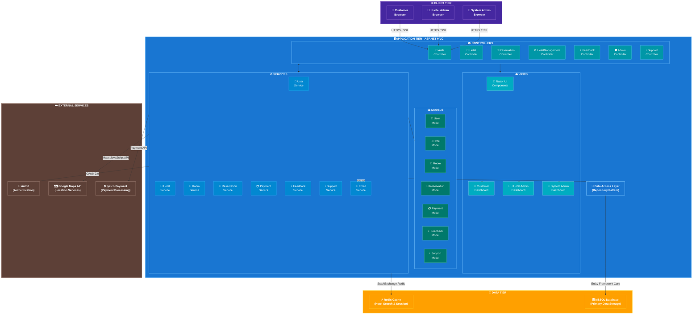

```mermaid
flowchart TD
    classDef clientNode fill:#4527A0,stroke:#7E57C2,stroke-width:2px,color:white,font-weight:bold
    classDef webNode fill:#1976D2,stroke:#64B5F6,stroke-width:2px,color:white,font-weight:bold
    classDef controllerNode fill:#0097A7,stroke:#4DD0E1,stroke-width:1px,color:white
    classDef modelNode fill:#00796B,stroke:#4DB6AC,stroke-width:1px,color:white
    classDef viewNode fill:#00ACC1,stroke:#80DEEA,stroke-width:1px,color:white
    classDef serviceNode fill:#0288D1,stroke:#29B6F6,stroke-width:1px,color:white
    classDef infrastructureNode fill:#FFA000,stroke:#FFCA28,stroke-width:2px,color:white,font-weight:bold
    classDef externalNode fill:#5D4037,stroke:#8D6E63,stroke-width:2px,color:white,font-weight:bold

    %% Main Client Section
    subgraph Clients["🌐 CLIENT TIER"]
        CB["👤 Customer<br/>Browser"]
        HAB["👨‍💼 Hotel Admin<br/>Browser"]
        SAB["🔧 System Admin<br/>Browser"]
    end

    %% Main Web Application Section
    subgraph WebApp["🖥️ APPLICATION TIER - ASP.NET MVC"]
        %% Controllers Subsection
        subgraph Controllers["🎮 CONTROLLERS"]
            AuthC["🔐 Auth<br/>Controller"]
            HotelC["🏨 Hotel<br/>Controller"]
            ResC["📅 Reservation<br/>Controller"]
            HMC["⚙️ HotelManagement<br/>Controller"]
            FeedbackC["⭐ Feedback<br/>Controller"]
            AdminC["🛡️ Admin<br/>Controller"]
            SupportC["📞 Support<br/>Controller"]
        end

        %% Models Subsection
        subgraph Models["📊 MODELS"]
            UserM["👤 User<br/>Model"]
            HotelM["🏨 Hotel<br/>Model"]
            RoomM["🚪 Room<br/>Model"]
            ResM["📅 Reservation<br/>Model"]
            PaymentM["💳 Payment<br/>Model"]
            FeedbackM["⭐ Feedback<br/>Model"]
            SupportM["📞 Support<br/>Model"]
        end

        %% Views Subsection
        subgraph Views["👁️ VIEWS"]
            RazorUI["🧩 Razor UI<br/>Components"]
            CustDash["👤 Customer<br/>Dashboard"]
            HotelAdminDash["👨‍💼 Hotel Admin<br/>Dashboard"]
            SysAdminDash["🔧 System Admin<br/>Dashboard"]
        end

        %% Services Subsection
        subgraph Services["⚙️ SERVICES"]
            UserS["👤 User<br/>Service"]
            HotelS["🏨 Hotel<br/>Service"]
            RoomS["🚪 Room<br/>Service"]
            ResS["📅 Reservation<br/>Service"]
            PaymentS["💳 Payment<br/>Service"]
            FeedbackS["⭐ Feedback<br/>Service"]
            SupportS["📞 Support<br/>Service"]
            EmailS["📧 Email<br/>Service"]
        end

        DAL["💾 Data Access Layer<br/>(Repository Pattern)"]
    end

    %% Data Tier Section
    subgraph Infra["💾 DATA TIER"]
        Redis["⚡ Redis Cache<br/>(Hotel Search & Session)"]
        MSSQL["🗄️ MSSQL Database<br/>(Primary Data Storage)"]
    end

    %% External Services Section
    subgraph External["☁️ EXTERNAL SERVICES"]
        Auth0["🔑 Auth0<br/>(Authentication)"]
        GMaps["🗺️ Google Maps API<br/>(Location Services)"]
        Iyzico["💲 Iyzico Payment<br/>(Payment Processing)"]
    end

    %% Connection Definitions with Labels
    CB -- "HTTPS / SSL" --> AuthC
    HAB -- "HTTPS / SSL" --> AuthC
    SAB -- "HTTPS / SSL" --> AuthC

    %% MVC Flow Connections
    Controllers <--> Services
    Services --> DAL
    Services --> Models
    Controllers --> Views

    %% View Dashboard Connections
    Views --> CustDash
    Views --> HotelAdminDash
    Views --> SysAdminDash
    
    %% Data Access Connections
    DAL -- "Entity Framework Core" --> MSSQL
    Services -- "StackExchange.Redis" --> Redis
    
    %% External Service Connections
    Services -- "OAuth 2.0" --> Auth0
    Services -- "Maps JavaScript API" --> GMaps
    Services -- "Payment API" --> Iyzico
    Services -- "SMTP" --> EmailS
    
    %% Apply Classes
    class Clients,CB,HAB,SAB clientNode
    class WebApp,Controllers,Models,Views,Services,DAL webNode
    class AuthC,HotelC,ResC,HMC,FeedbackC,AdminC,SupportC controllerNode
    class UserM,HotelM,RoomM,ResM,PaymentM,FeedbackM,SupportM modelNode
    class RazorUI,CustDash,HotelAdminDash,SysAdminDash viewNode
    class UserS,HotelS,RoomS,ResS,PaymentS,FeedbackS,SupportS,EmailS serviceNode
    class Infra,Redis,MSSQL infrastructureNode
    class External,Auth0,GMaps,Iyzico externalNode
``` 