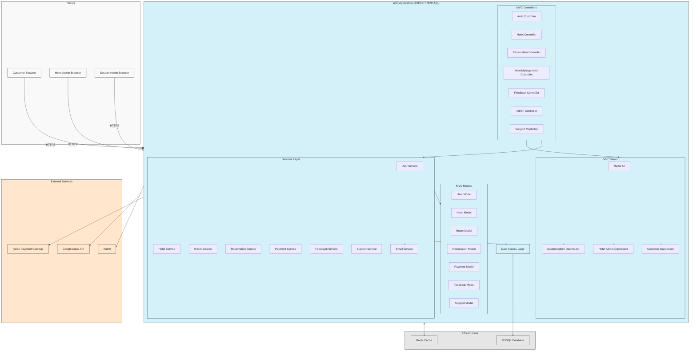

```mermaid
graph TD
    %% Define Client Nodes
    subgraph Clients["Clients"]
        CB["Customer Browser"]
        HAB["Hotel Admin Browser"]
        SAB["System Admin Browser"]
    end

    %% Define Web Application Nodes
    subgraph WebApp["Web Application (ASP.NET MVC App)"]
        subgraph Controllers["MVC Controllers"]
            AuthC["Auth Controller"]
            HotelC["Hotel Controller"]
            ResC["Reservation Controller"]
            HMC["HotelManagement Controller"]
            FeedbackC["Feedback Controller"]
            AdminC["Admin Controller"]
            SupportC["Support Controller"]
        end

        subgraph Models["MVC Models"]
            UserM["User Model"]
            HotelM["Hotel Model"]
            RoomM["Room Model"]
            ResM["Reservation Model"]
            PaymentM["Payment Model"]
            FeedbackM["Feedback Model"]
            SupportM["Support Model"]
        end

        subgraph Views["MVC Views"]
            RazorUI["Razor UI"]
            CustDash["Customer Dashboard"]
            HotelAdminDash["Hotel Admin Dashboard"]
            SysAdminDash["System Admin Dashboard"]
        end

        subgraph Services["Services Layer"]
            UserS["User Service"]
            HotelS["Hotel Service"]
            RoomS["Room Service"]
            ResS["Reservation Service"]
            PaymentS["Payment Service"]
            FeedbackS["Feedback Service"]
            SupportS["Support Service"]
            EmailS["Email Service"]
        end

        DAL["Data Access Layer"]
    end

    %% Define Infrastructure Nodes
    subgraph Infra["Infrastructure"]
        Redis["Redis Cache"]
        MSSQL["MSSQL Database"]
    end

    %% Define External Services Nodes
    subgraph External["External Services"]
        Auth0["Auth0"]
        GMaps["Google Maps API"]
        Iyzico["Iyzico Payment Gateway"]
    end

    %% Define Connections
    CB -- "HTTPS" --> WebApp
    HAB -- "HTTPS" --> WebApp
    SAB -- "HTTPS" --> WebApp

    %% MVC Flow
    Controllers --> Services
    Services --> DAL
    Services --> Models
    Controllers --> Views

    %% Data Access
    DAL --> MSSQL
    WebApp <--> Redis
    
    %% External Integrations
    WebApp --> Auth0
    WebApp --> GMaps
    WebApp --> Iyzico
    WebApp --> EmailS

    %% Role-based Dashboards
    Views --> CustDash
    Views --> HotelAdminDash
    Views --> SysAdminDash

    %% Style
    classDef clientNode fill:#f9f9f9,stroke:#333,stroke-width:1px;
    classDef webAppNode fill:#d4f1f9,stroke:#333,stroke-width:1px;
    classDef infraNode fill:#e6e6e6,stroke:#333,stroke-width:1px;
    classDef externalNode fill:#ffe6cc,stroke:#333,stroke-width:1px;

    class Clients,CB,HAB,SAB clientNode;
    class WebApp,Controllers,Models,Views,Services,DAL webAppNode;
    class Infra,Redis,MSSQL infraNode;
    class External,Auth0,GMaps,Iyzico externalNode;
``` 